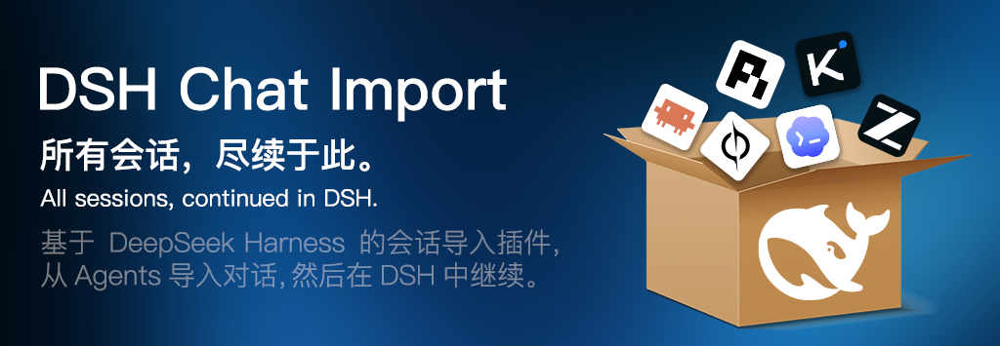

<div align="center">



# DSH Chat Import

**基于 DeepSeek Harness 构建的会话导入插件，一键导入外部 Agents 的聊天历史并在 DeepSeek Harness 中继续对话。**

> **所有会话，尽续于此。**

[](README.md) [](README.zh-CN.md)

[](https://www.npmjs.com/package/dsh-chat-import)
[](https://www.npmjs.com/package/dsh-chat-import)
[](https://github.com/Nwflower/dsh-chat-import)
[](LICENSE)
[](https://awesome-dsh-plugin.com)
[](https://www.dsh.so/artifact/dsh-chat-import/)

</div>


## 简介

`DSH Chat Import` 从其他Agents导入含完整上下文的聊天历史，成为无缝继续的 DeepSeek Harness 会话。

现已支持下述工具的导入：Claude Code、Codex、ChatGPT、Cursor、Gemini、Reasonix、opencode、MiMo Code、ZCode、Grok Build、OpenClaw、Pi Coding Agent、Hermes、Kimi CLI / Kimi Code、Qoder CLI、WorkBuddy 与 DSH 会话日志；

下述工具的反向导入：Claude Code、Codex、Kimi Code。


## 安装

```bash
dsh plugin --profile web add dsh-chat-import                    # npm 包
dsh plugin --profile web add -w link:/path/to/dsh-chat-import   # 本地源码（符号链接）
```

## 使用

1. **导入** — 在GUI界面右下角的导入会话面板选择你想导入的会话并一键导入。或让你的Agent调用上下文工具进行导入：

```
import_chat({ format: "claude", path: "~/.claude/projects" })
import_chat({ format: "chatgpt", path: "~/Downloads/chatgpt-export/conversations.json" })
import_chat({ format: "local-jsonl", path: "D:\downloads\session.jsonl" })
```

2. **续聊** — 刷新会话列表，打开导入的会话，从源记录停下的地方继续对话。

3. **同步（可选）** — 面板「同步」页提供双向增量同步，默认关闭。子代理对话默认双向过滤。

完整工具 / 命令用法（参数、示例、边界行为）见 **[docs/USAGE.zh-CN.md](docs/USAGE.zh-CN.md)**。

## 功能一览

| 能力 | 入口 | 说明 |
| --- | --- | --- |
| 批量导入 17+ 源 | `import_chat`（18 种格式）· `scan_discover` · 侧边栏面板 · `/import` | 单个文件、目录或整个数据库，每段对话成为独立会话 |
| 全保真续聊 | 导入即 DSH 会话 | 工具调用/结果、思考、标题、模型、时间戳原样保留，按源 `cwd` 归组工作区 |
| 矩阵导出 | `export_chat`（`format: claude` / `codex` / `kimi`） | DSH 会话序列化回 Claude / Codex / Kimi 格式，有损项逐条报告 |
| 便携备份 | `export_bundle` / `restore_bundle` | SHA-256 双指纹的 interchange bundle，可跨机器还原 |
| 增量写回 | `sync_to_claude` | 新增完整轮次追加回 Claude Code 文件，带守卫绝不覆盖 |
| 双向同步 | 面板「同步」页 | Claude / Codex / Grok 双向增量同步；子代理对话默认过滤；`excludeDirs` 按目录排除 |
| Agent 资产迁移 | `import_agents` | pi / opencode / Claude / Codex 的 agent、prompt、skill、指令转成 DSH skills |
| MCP 镜像计划 | `import_mcp` / `/mcp-status` | 读取 Claude / Codex MCP server，生成可审阅的 DSH MCP client YAML 片段 |
| 配置翻译建议 | `import_settings` / `/settings-suggest` | Claude settings / Codex config 转 DSH 迁移建议（只读） |
| 交接摘要 | `/resume-claude` / `/resume-codex` | 外部 transcript 当不可信历史，生成交接摘要注入当前会话 |
| 只读审计 / 体检 | `verify_session` / `doctor` / CLI `dsh-chat-import doctor` | 结构审计与迁移健康检查 |
| 幂等与保护 | `import_chat`（全部来源） | `expectedHash` / `restamp` / 上下文预算保护；未变跳过、增长只追加 |
| 预设模式 + 系统提示词 | 设置页「插件」分区 TAB | 导入会话补录默认预设模式；可选「导入系统提示词」作为上下文注入（默认关） |

## 文档

| 文档 | 说明 |
| --- | --- |
| [使用详解](docs/USAGE.zh-CN.md) | 每个工具 / 命令的完整参数、示例与边界行为 |
| [互转协议](docs/INTERCHANGE.md) | Interchange v1 协议与 bundle 格式 |
| [更新日志](CHANGELOG.md) | 版本历史（英文） |
| [路线图](ROADMAP.md) | 已实现 / 规划 |
| [贡献指南](CONTRIBUTING.md) | 开发环境、提交规范、安全与隐私 |

## Star History

[](https://www.star-history.com/?type=date&repos=Nwflower%2Fdsh-chat-import)
